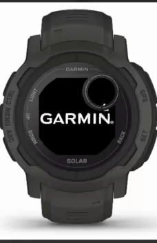

# qplan

DIR-oriented dive planning toolbox for Garmin smartwatches

## Features

- Segment table generator
- Minimum gas calculator
- Supports most common cylinders
- Full support for metric & imperial

## Devices

Supported:
- Descent G1
